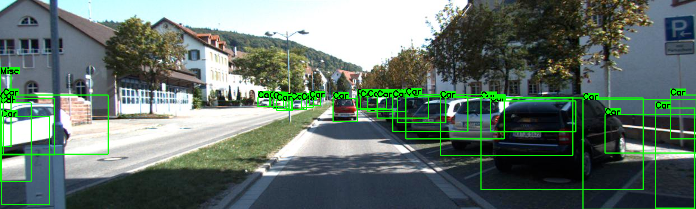

## Data:

Dataloaders load data from datasets that are in yolo format. To convert other (or custom) datasets into the yolo format, you can create your own converter script that takes in a source path and a destination path. In the destination path, the file structure is the following:

```
root/
|---- images
     |---- {id}.jpeg
     |---- ...
|---- labels
     |---- train
          |---- {id}.txt
          |---- ...
     |---- val
          |---- {id}.txt
          |---- ...
```

## Detections:


